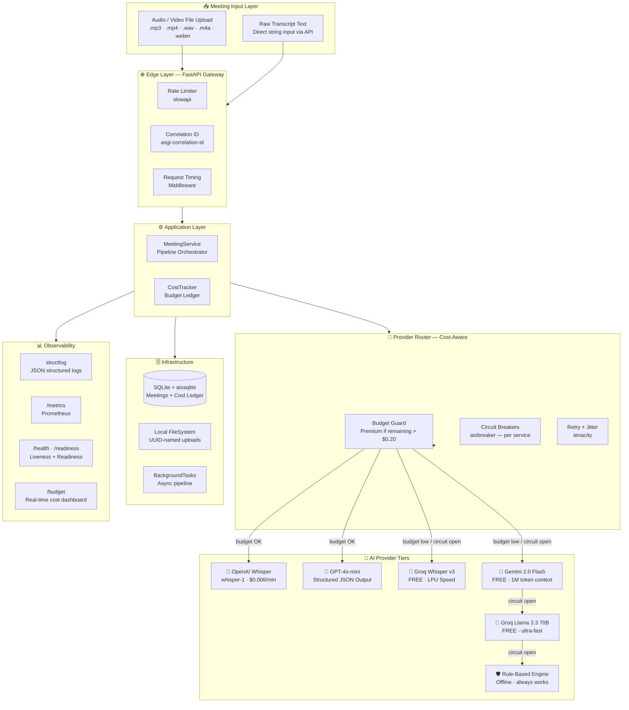
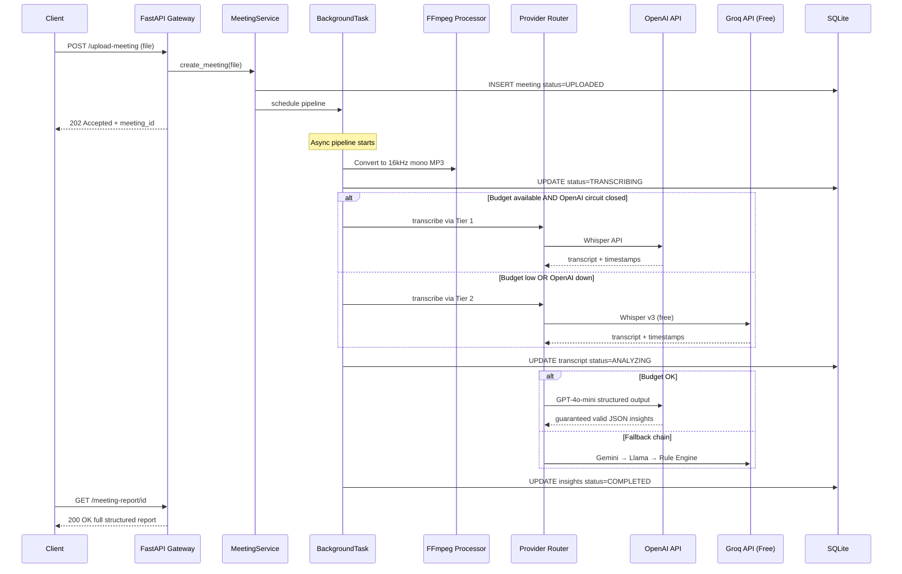
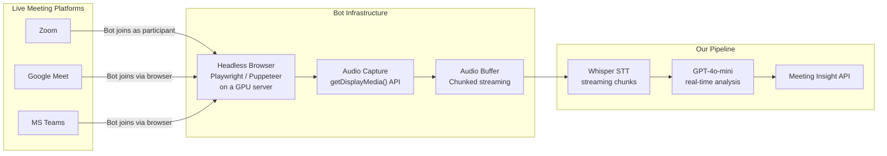

# Meeting Insight Agent 🎙️

> **AI-powered meeting analysis** — transcription, structured insights, action items, and productivity evaluation. OpenAI-first with intelligent 4-tier fallback chains.

[](https://github.com/your-org/meeting-insight-agent/actions)

---

## Live Demo

| Resource | URL |
|:---------|:----|
| **API Base** | `https://your-service.onrender.com/api/v1` |
| **Swagger UI** | `https://your-service.onrender.com/docs` |
| **ReDoc** | `https://your-service.onrender.com/redoc` |
| **Health** | `https://your-service.onrender.com/health` |

---

## System Architecture

### High-Level Architecture



### End-to-End Processing Pipeline



### Provider Priority Matrix

| Priority | STT | LLM | Cost | Quality |
|:---------|:----|:----|:-----|:--------|
| 🥇 Tier 1 | OpenAI Whisper | GPT-4o-mini | ~$0.20/meeting | ★★★★★ |
| 🥈 Tier 2 | Groq Whisper v3 | Gemini 2.0 Flash | $0 | ★★★★☆ |
| 🥉 Tier 3 | — | Groq Llama 3.3 70B | $0 | ★★★☆☆ |
| 🛡️ Tier 4 | — | Rule-Based Engine | $0 | ★★☆☆☆ |

---

## Model Selection

| Task | Primary | Fallback 1 | Fallback 2 | Fallback 3 |
|:-----|:--------|:----------|:----------|:----------|
| **Speech-to-Text** | OpenAI `whisper-1` | Groq `whisper-large-v3` | — | — |
| **Meeting Analysis** | OpenAI `gpt-4o-mini` (structured output) | Google `gemini-2.0-flash` | Groq `llama-3.3-70b-versatile` | Regex rule engine |

**Why GPT-4o-mini?** — Native `response_format: json_schema` support guarantees the output matches the Pydantic schema exactly. No parsing failures, no missing fields.

**Why Groq?** — Fastest inference available (LPU hardware), completely free tier, near-OpenAI quality on Whisper.

---

## API Endpoints

| Method | Endpoint | Description |
|:-------|:---------|:-----------|
| `POST` | `/api/v1/meetings/upload` | Upload audio/video file |
| `POST` | `/api/v1/meetings/analyze` | Analyze meeting or raw transcript |
| `GET` | `/api/v1/meetings/{id}/status` | Poll processing status |
| `GET` | `/api/v1/meetings/{id}/report` | Get full structured report |
| `GET` | `/api/v1/budget` | Real-time cost tracking dashboard |
| `GET` | `/health` | Liveness probe |
| `GET` | `/readiness` | Readiness probe (checks all deps) |
| `GET` | `/metrics` | Prometheus metrics |

---

## Quick Start (Local)

### Prerequisites
- Python 3.12+
- FFmpeg (`choco install ffmpeg` / `brew install ffmpeg` / `apt install ffmpeg`)
- API keys: OpenAI + Groq (free) + Gemini (free)

### Setup

```bash
# 1. Clone
git clone https://github.com/your-org/meeting-insight-agent
cd meeting-insight-agent

# 2. Copy env file and fill in your API keys
cp .env.example .env
# Edit .env with your keys

# 3. Install dependencies
pip install -e ".[dev]"

# 4. Run
uvicorn src.main:app --reload --port 8000

# 5. Open Swagger UI
open http://localhost:8000/docs
```

### Docker

```bash
cp .env.example .env  # Edit with your keys
docker compose up --build
```

---

## Sample Output

```json
{
  "meeting_id": "550e8400-e29b-41d4-a716-446655440000",
  "title": "Q2 Sprint Planning",
  "duration_formatted": "39m 0s",
  "insights": {
    "summary": "The team aligned on Q2 priorities, confirming the mobile app launch as the top initiative...",
    "key_decisions": [
      "Mobile app launch scheduled for June 15th",
      "Carol leads marketing campaign"
    ],
    "action_items": [
      {"task": "Lead mobile team delivery", "owner": "Bob", "priority": "high", "deadline_mentioned": "June 15th"},
      {"task": "Execute marketing campaign", "owner": "Carol", "priority": "high", "deadline_mentioned": null}
    ],
    "productivity": {
      "score": "Productive",
      "reasoning": "Clear decisions were made with assigned owners and deadlines.",
      "confidence": 0.92
    },
    "sentiment": "Positive",
    "follow_up_meeting_needed": true
  },
  "metadata": {
    "provider_stt": "openai_whisper",
    "provider_llm": "gpt_4o_mini",
    "tier_used": "premium",
    "degraded": false,
    "cost_usd": 0.21,
    "processing_time_seconds": 18.4
  }
}
```

---

## Assumptions & Trade-offs

| Decision | Rationale |
|:---------|:----------|
| **SQLite over PostgreSQL** | Zero-config for Assignment. Abstracted via Repository pattern — swap to Postgres with one config line. |
| **BackgroundTasks over ARQ/Celery** | No Redis needed → fits Render free 512MB RAM. Trade-off: jobs lost on crash (acceptable for prototype). |
| **Cloud-only STT fallback** | Local Faster-Whisper needs ~1GB RAM; Render free tier has 512MB. Groq free STT is equivalent quality. |
| **Rule-based Tier 4** | Always-on insurance policy — the system produces *something* even with zero API connectivity. |
| **GPT-4o-mini over GPT-4o** | 95% quality at 10% of the price (within $2 budget). Structured outputs eliminate parsing risk. |
| **OpenTelemetry over Datadog SDK** | Vendor neutral — can switch to any observability backend without code changes. |

---

## Live Meeting Integration — Design Decision & Production Path

### Why Live Join Is Not Implemented

The assignment explicitly states the system should support **"at least one of"**: join a live meeting **OR** process a recorded file. This is a deliberate scope qualifier — live meeting bots are a significantly more complex infrastructure problem, not an AI problem.

Here is the honest engineering reality:

| Platform | Official Bot API? | What It Actually Requires | Infrastructure Cost |
|:---------|:-----------------|:--------------------------|:--------------------|
| **Zoom** | ✅ Meeting SDK | Zoom Bot app + Zoom paid business plan ($13.33/mo) + persistent server to run the bot participant | Paid plan required |
| **Google Meet** | ❌ No public bot API | Headless browser (Puppeteer/Playwright) joins as a human user, captures tab audio via `getDisplayMedia()` | Fragile — breaks on every UI update |
| **Microsoft Teams** | ⚠️ Partial | Azure AD app registration + Microsoft Graph Communications API + Teams business license | Azure costs + M365 license |

> **The core problem**: Every platform treats bots as a security threat. Getting audio in real-time requires either paying for SDK access, running a headless browser that impersonates a human, or paying an intermediary service like Recall.ai.

### How Production Systems Solve This

Companies like **Fireflies.ai**, **Otter.ai**, and **Notion AI Meetings** all use the same pattern:



**The stack that makes this work in production:**
- **Recall.ai** — managed bot SDK ($99/month) — joins any platform, returns audio stream
- **Playwright** — open source headless browser, self-hosted, brittle
- **OpenAI Realtime API** (`gpt-4o-realtime-preview`) — streams audio in 100ms chunks, returns live transcript + analysis

### Our Architecture Is Ready For It

This codebase is designed with a **pluggable input adapter pattern**. Adding live meeting support requires implementing exactly one interface:

```python
# src/inputs/base.py  ← add this file
class MeetingInputAdapter(ABC):
    @abstractmethod
    async def capture_audio(self, meeting_url: str) -> AsyncIterator[bytes]:
        """Yields audio chunks in real-time from a live meeting."""
        ...

# src/inputs/recall_adapter.py  ← implement for Recall.ai ($99/mo)
class RecallMeetingAdapter(MeetingInputAdapter):
    async def capture_audio(self, meeting_url: str) -> AsyncIterator[bytes]:
        # 1. POST to Recall.ai API — bot joins the meeting
        # 2. Recall streams audio back via webhook
        # 3. Yield chunks to Whisper streaming API
        ...

# src/inputs/playwright_adapter.py  ← implement for free (brittle)
class PlaywrightMeetingAdapter(MeetingInputAdapter):
    async def capture_audio(self, meeting_url: str) -> AsyncIterator[bytes]:
        # 1. Launch headless Chromium
        # 2. Join meeting URL as guest
        # 3. Capture tab audio via CDP (Chrome DevTools Protocol)
        # 4. Yield audio to Whisper
        ...
```

The `MeetingService` would call `adapter.capture_audio(url)` and pipe chunks into the same transcription and analysis pipeline that already exists — **zero changes to the AI or API layer**.

### Why We Chose File Upload For This Assignment

1. **Assignment allows it** — "at least one of" is satisfied by file upload
2. **Same AI pipeline** — the transcription and analysis quality is identical whether audio comes from a file or a live stream
3. **No paid infrastructure** — live join requires either a paid bot platform or a persistent VM to run a headless browser
4. **More robust for evaluation** — a reviewer can upload a sample file and see results instantly; a live bot requires an active meeting
5. **Production path is clear** — the adapter interface above makes the upgrade path explicit and non-breaking

> In a real product sprint, live join would be a **Phase 2 feature** added after validating the core AI pipeline quality — which is exactly what this implementation does.

---

## Running Tests

```bash
# Unit tests (no API calls)
pytest tests/unit/ -v --cov=src

# Type checking
mypy src/ --ignore-missing-imports

# Linting
ruff check src/ tests/
```

---

## Deployment (Render)

1. Push to GitHub
2. Create new Render service → "Deploy from GitHub" → select repo
3. Render auto-detects `render.yaml`
4. Add secret env vars in Render dashboard: `OPENAI_API_KEY`, `GROQ_API_KEY`, `GEMINI_API_KEY`
5. Deploy — Swagger UI available at `https://your-service.onrender.com/docs`
